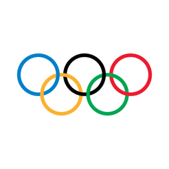
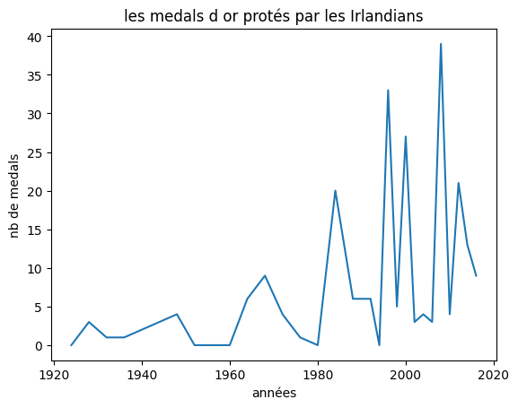
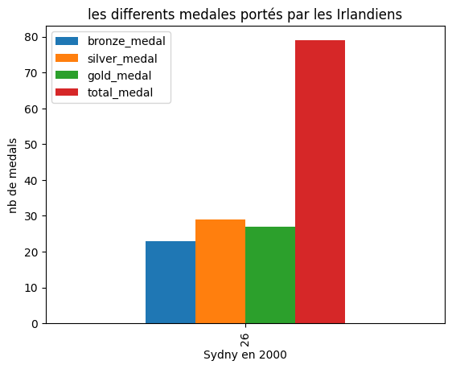

# mini_projet
## Les jeux olumpics

## Présentation 

Il s'agit d'un ensemble de données historiques sur les Jeux Olympiques modernes, d'Athènes 1896 à Rio 2016. Chaque ligne se compose d'un athlète individuel participant à une épreuve olympique et de la médaille remportée (le cas échéant).

**Dictionnaire de données**

|Column   |Explanation                   |
| ------- | ---------------------------- |
|id       |Unique number for each athlete |
|name     |Athlete's name                 |
|sex      |M or F                         |
|age      |Age of the athlete                        |
|height   |In centimeters                 |
|weight   |In kilograms                   |
|team     |Team name                      |
|noc      |National Olympic Committee 3   |
|games    |Year and season                |
|year     |Integer                        |
|season   |Summer or Winter               |
|city     |Host city                      |
|sport    |Sport                          |
|event    |Event                          |
|medal    |Gold, Silver, Bronze, or NA    |

**:file_folder: base de données**

|    |   Unnamed: 0 |   id | name                     | sex   |   age |   height |   weight | team           | noc   | games       |   year | season   | city      | sport         | event                            | medal   |
|---:|-------------:|-----:|:-------------------------|:------|------:|---------:|---------:|:---------------|:------|:------------|-------:|:---------|:----------|:--------------|:---------------------------------|:--------|
|  0 |            0 |    1 | A Dijiang                | M     |    24 |      180 |       80 | China          | CHN   | 1992 Summer |   1992 | Summer   | Barcelona | Basketball    | Basketball Men's Basketball      | nan     |
|  1 |            1 |    2 | A Lamusi                 | M     |    23 |      170 |       60 | China          | CHN   | 2012 Summer |   2012 | Summer   | London    | Judo          | Judo Men's Extra-Lightweight     | nan     |
|  2 |            2 |    3 | Gunnar Nielsen Aaby      | M     |    24 |      nan |      nan | Denmark        | DEN   | 1920 Summer |   1920 | Summer   | Antwerpen | Football      | Football Men's Football          | nan     |
|  3 |            3 |    4 | Edgar Lindenau Aabye     | M     |    34 |      nan |      nan | Denmark/Sweden | DEN   | 1900 Summer |   1900 | Summer   | Paris     | Tug-Of-War    | Tug-Of-War Men's Tug-Of-War      | Gold    |
|  4 |            4 |    5 | Christine Jacoba Aaftink | F     |    21 |      185 |       82 | Netherlands    | NED   | 1988 Winter |   1988 | Winter   | Calgary   | Speed Skating | Speed Skating Women's 500 metres | nan     |

## Analyse
On note à travers ces données ,que 5718 joueurs néerlandais ont participé aux jeux olympiques de 1896 à2016 .
Et on observe que dans cette période ces dernies a remportés plusieurs médailles dans le parcours de sa participation, qui fut multiples.

Les Irlandais au début n'accordaient pas l'importance et la valeur au jeux olympics , mais ils ont changés cette montalaité, ou l'on voit qu'ils ont obtenu plusieurs medailles de bronze , d'argent et aussi d'or à la fin de XXe siècle.

   Exemple d'augmentation des médailles selon les années   

## Conclusion 

  Comme nous pouvons le voir sur ce graphique que les Irlandais ont obtenus le splus grand nombre de médailles en l'an 2000 à Sydney.
  Ils ont gagné 23 medaille de bronze , 27 medaille d'or et 29 medaille d'argent.Etre total 79.

